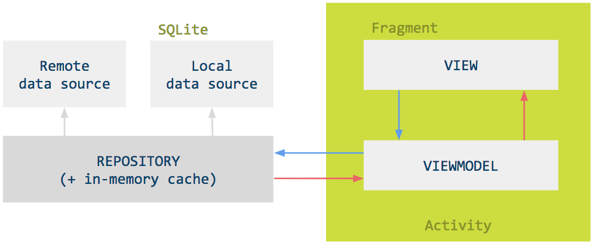
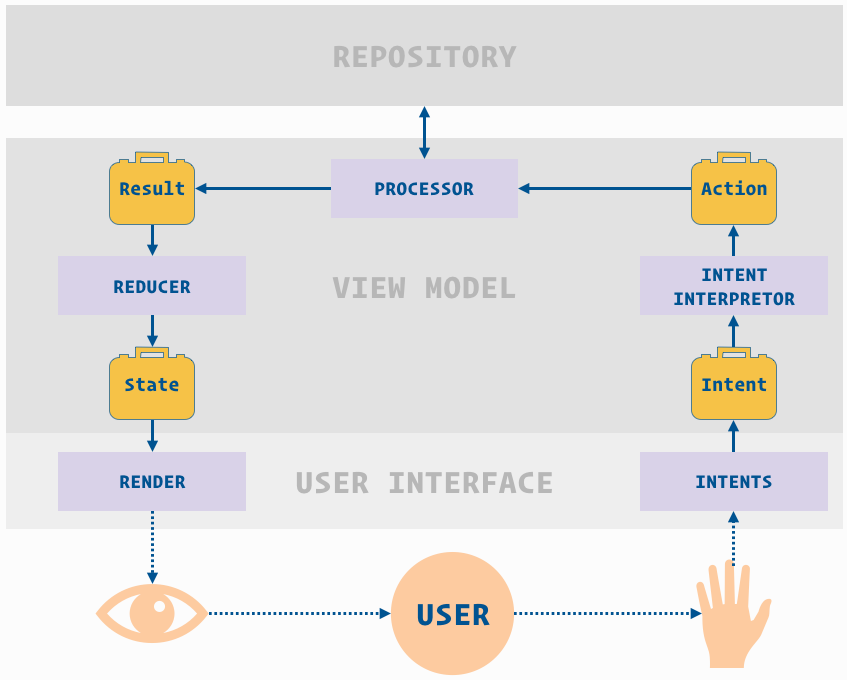

# Kotlin Playground (work-in-progress)

## Android development

App which attempts to use the latest cutting edge libraries and tools. As a summary:

 * Entirely written in [Kotlin](https://kotlinlang.org/)
 * Unidirectional data flow (fully reactive architecture)
 * Uses [RxJava](https://github.com/ReactiveX/RxJava) 2
 * Uses [RxAndroid](https://github.com/ReactiveX/RxAndroid) and [RxKotlin](https://github.com/ReactiveX/RxKotlin) Extensions 
 * Uses all of the [Architecture Components](https://developer.android.com/topic/libraries/architecture/): Room, LiveData and Lifecycle-components
 * Uses [dagger-android](https://google.github.io/dagger/android.html) for dependency injection
 * Uses [Glide](https://github.com/bumptech/glide) for image loading
 * Uses [Groupie](https://github.com/lisawray/groupie) for RecyclerView layouts with Kotlin support

## Development setup

First off, you require the latest Android Studio 3.0 (or newer) to be able to build the app.

### Code style

This project uses [ktlint](https://github.com/shyiko/ktlint), provided via
the [spotless](https://github.com/diffplug/spotless) gradle plugin, and the bundled project IntelliJ codestyle.

If you find that one of your pull reviews does not pass the CI server check due to a code style conflict, you can
easily fix it by running: `./gradlew spotlessApply`, or running IntelliJ/Android Studio's code formatter.

### Architecture

The architecture used in this app is based on an Android ported version of the Model-View-Intent architecture and uses RxJava to implement the reactive characteristic of the architecture. It takes learnings from:
- [TODO-MVP-KOTLIN](https://github.com/oldergod/android-architecture/tree/todo-mvi-rxjava-kotlin)
- [BUFFER-MVI-CLEAN-ARCHITECTURE](https://github.com/bufferapp/android-clean-architecture-mvi-boilerplate)

The MVI architecture embraces reactive and functional programming. The two main components of this architecture, the _View_ and the _ViewModel_ can be seen as functions, taking an input and emiting outputs to each other. The _View_ takes input from the _ViewModel_ and emit back _intents_. The _ViewModel_ takes input from the _View_ and emit back _view states_. This means the _View_ has only one entry point to forward data to the _ViewModel_ and vice-versa, the _ViewModel_ only has one way to pass information to the _View_.  
This is reflected in their API. For instance, The _View_ has only two exposed methods:

```kotlin
interface MviView {
  fun intents(): Observable<MviIntent>

  fun render(state: MviViewState)
}
```

A _View_ will a) emit its intents to a _ViewModel_, and b) subscribes to this _ViewModel_ in order to receive _states_ needed to render its own UI.

A _ViewModel_ exposes only two methods as well:

```kotlin
interface MviViewModel {
  fun processIntents(intents: Observable<MviIntent>)

  fun states(): Observable<MviViewState>
}
```

A _ViewModel_ will a) process the _intents_ of the _View_, and b) emit a _view state_ back so the _View_ can reflect the change, if any.



### The User is a function

The MVI architecture sees the user as part of the data flow, a functionnal component taking input from the previous one and emitting event to the next. The user receives an input―the screen from the application―and ouputs back events (touch, click, scroll...). On Android, the input/output of the UI is at the same place; either physically as everything goes through the screen or in the program: I/O inside the activity or the fragment. Including the User to seperate the input of the view from its output helps keeping the code healty.



### MVI in details

We saw what the _View_ and the _ViewModel_ were designed for, let's see every part of the data flow in details.

#### Intent

_Intents_ represents, as their name goes, _intents_ from the user, this goes from opening the screen, clicking a button, or reaching the bottom of a scrollable list.

#### Action from Intent

_Intents_ are in this step translated into their respecting logic _Action_. For instance, inside the tasks module, the "opening the view" intent translates into "refresh the cache and load the data". The _intent_ and the translated _action_ are often similar but this is important to avoid the data flow to be too coupled with the UI. It also allows reuse of the same _action_ for multiple different _intents_.

#### Action

_Actions_ defines the logic that should be executed by the _Processor_.

#### Processor

_Processor_ simply executes an _Action_. Inside the _ViewModel_, this is the only place where side-effects should happen: data writing, data reading, etc.

#### Result

_Results_ are the result of what have been executed inside the Processor. Their can be errors, successful execution, or "currently running" result, etc.

#### Reducer

The _Reducer_ is responsible to generate the _ViewState_ which the View will use to render itself. The _View_ should be stateless in the sense that the _ViewState_ should be sufficient for the rendering. The _Reducer_ takes the latest _ViewState_ available, apply the latest _Result_ to it and return a whole new _ViewState_.

#### ViewState

The _State_ contains all the information the _View_ needs to render itself.